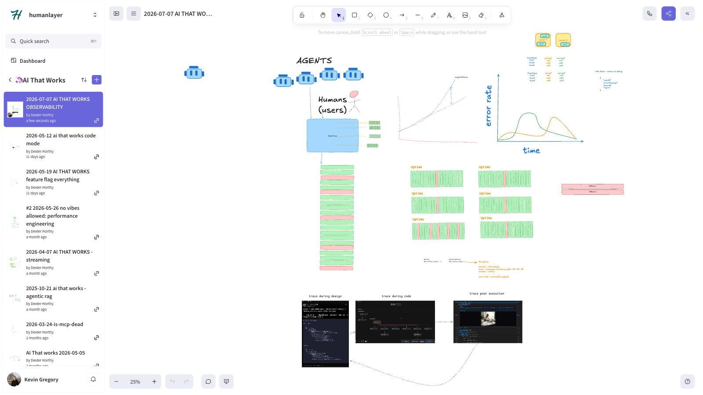

# 🦄 ai that works: agent observability

> A deep dive into why observability, not code reading, is now the only way to understand what your AI agents are actually doing, and how to build tracing that both humans and agents can query.

[Video](https://www.youtube.com/watch?v=_WLVv1C6-VM)

Links:

- [Session Code](https://github.com/ai-that-works/ai-that-works/tree/main/2026-07-07-agent-observability)

## Episode Highlights

> "I don't read every line of code anymore. I read invariants, I read the very low layers, I read the API surface area, but I don't read every line of code. It's too much of a pain in the ass."

> "Observability is not useful at all for things you already know. Observability is useful in hindsight."

> "In a world where agents write all the code and everything is non-deterministic, tracing is the only way to understand all the data."

> "Go write a ton of traces in your code base and just vibecode the hell out of it and make it really easy for agents to go query everything."

> "The usefulness of a tracing system is merely a function of how much tracing you were able to tag on when you shipped the code."

## Key Takeaways

- **Observability only pays off in hindsight, so the instrumentation has to already be there.** You can't have foresight about a bug; if you already knew where it was, you'd just fix it. The value of tracing is being able to go back and look after a user reports something broken, instead of trying to reproduce it blind, which means the tracing has to exist before the bug happens.
- **A rising error count doesn't mean your system is getting worse.** As agents get more capable, user expectations climb even faster, so the gap between what people think the system can do and what it can actually do keeps growing. Every time a user runs into that gap, you get a red mark, even though the system itself is improving.
- **Wide, structured events beat plain OpenTelemetry, because OTel forces you to flatten everything into strings.** OTel only accepts strings, booleans, numbers, and simple sequences, so most teams end up running `json.dumps()` on anything complex and lose the ability to query it. Turning 100 bytes of real data into a JSON string can balloon it to 800 bytes over the wire, a real hit to latency and cost once you're tracing everything.
- **Type your traces the same way you type your code, so an agent can query them like a database.** A query like `user.images.generate_image where args.thing.length > 50 and latency > 1s` only works if the trace knows the input is a string and the output is an image, the same way your code does. Once traces carry that shape, an agent can write its own queries against production behavior instead of you writing custom log-grepping scripts every time.
- **Trace the full spectrum: design, code, and execution, and feed what you learn back into the next round.** Trace during planning (asking Claude Code to show call stacks before approving a plan), while the code exists (reading a flame graph instead of every line it calls), and after it runs in production. Close the loop by feeding the execution trace back to the model and asking what was missing from the design that made the real call stack diverge from what was planned.
- **Instrument by default, not by exception.** Trace every fetch call, capture every LLM input and output, and automatically redact the risky stuff (headers, env vars, API keys) so logging isn't a judgment call made function by function. If an agent is writing most of the code, it won't remember to add tracing every time unless the system does it automatically, and without that data, there's zero chance of debugging an issue after the fact.

## Resources

- [Session Recording](https://www.youtube.com/watch?v=_WLVv1C6-VM)
- [Discord Community](https://boundaryml.com/discord)
- Sign up for the next session on [Luma](https://lu.ma/baml)

## Whiteboards

