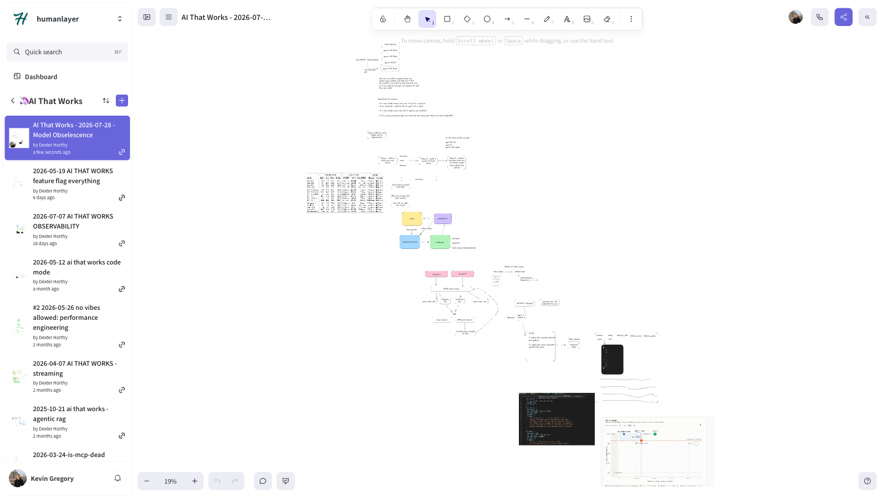

# 🦄 ai that works: Your Model is Already Obsolete

> Model deprecation is one of the only outages you get advance notice of.
> Here's the harness that turns it into a Tuesday instead of a P0.

[Sign up on Luma](https://luma.com/easy-model-swaps) · Tue 2026-07-28, 18:00 UTC

[](https://www.youtube.com/watch?v=Y-I9m5YsAcs)

## The idea

Throw a model at the harness. It runs your test cases and reports
accuracy, token cost, and p95 latency **against the model you're running
today**. Then it gates:

- **Clears your regression budget?** Change one string. Go home.
- **Doesn't?** It hands the prompt to the optimizer and re-checks.

The budget is relative, never absolute:

> You don't need the new model to be good. You need it to be no worse.

The same harness does three jobs: survive a deprecation, evaluate every
new model the day it drops, and find out whether a cheaper model would
have been fine all along.

See [ARCHITECTURE.md](ARCHITECTURE.md) for the diagrams.

## Running it

```bash
uv sync
uv run python -m harness.testgen        # corpus -> BAML test blocks
uv run baml-cli generate --from baml_src

# throw a candidate at the incumbent
uv run python -m harness.cli --candidate CandSonnet5

# same harness, hunting for something cheaper
uv run python -m harness.cli --candidate CandGemini36Flash --cost-down

# the gate's spec
uv run pytest
```

Needs `OPENAI_API_KEY`, `ANTHROPIC_API_KEY` and `GOOGLE_API_KEY` in the
repo-root `.env`.

## Obsolete vs deprecated

Two different problems, and conflating them is what makes teams
complacent:

- **Obsolete** — superseded by something better or cheaper. No deadline.
  An *opportunity* you're leaving on the table.
- **Deprecated** — an announced end-of-life with a date on it. An
  *obligation*.

`gpt-4o` is the incumbent here and it is the first kind. As of 2026-07-27
it has no announced OpenAI retirement date, but it has been de-listed from
the models index, the comparison page and the pricing page — while the
endpoint stays live at $2.50/$10. Reachable if you know the id, invisible
if you don't. "It still works" is true right up until it isn't.

## Things we measured that surprised us

- **`gpt-4o` is the fastest model in the cast** — 1293ms p50, against
  2523ms for `claude-sonnet-5` and 4605ms for `gemini-3.6-flash`. The
  model being pushed out is the quickest thing available.
- **"Flash" isn't fast.** Both Gemini Flash models were the slowest tested.
- **Single-run evals lie.** These models are non-deterministic on this
  task. One sample per case produced two confidently wrong conclusions
  during development. Everything here runs 3 repeats by default.
- **An unverified price is not zero.** Defaulting a missing price to
  `0.0` made unpriced models pass the cost gate at `0.00x` — a guaranteed
  false PASS on four of five candidates. The gate now refuses to judge
  rather than guess.
- **A broken eval is worse than no eval.** An assertion of
  `{{this.tax == null}}` is *always false* — BAML's Jinja has no `null`
  literal, it's `none`. The optimizer spent a full run and real money
  chasing a test no output could satisfy, reported a flat pass rate with
  zero improvement, and never once flagged the metric as unsatisfiable.
  The proof was sitting in its own reflection logs: the recorded output
  was correct, directly above `"Assertion 'tax_omitted' failed"`.

## Replaying the optimizer run

The committed run under `.baml_optimize/` can be browsed in an interactive
TUI for zero tokens:

```
uv run --no-project --with baml-py==0.223.0 baml-cli optimize \
    --view --run-dir .baml_optimize/run_20260727_211237
```

The `uv run --with baml-py==0.223.0` prefix is required — `optimize`
landed in BAML 0.215 and older CLIs do not have the subcommand. The viewer
also needs a real TTY; piped or redirected it fails with "Device not
configured".

## A note on `gate.py`

It's written live during the episode. `tests/test_gate.py` is its full
spec and is written first — to reproduce the segment, delete
`harness/gate.py`, run `uv run pytest`, and type it back.

## Prior episodes this builds on

- [2025-07-29 — Evaluating Prompts Across Models](../2025-07-29-eval-many-models-same-prompt/)
  — choosing a model. This episode is about being forced off one.
- [2025-12-16 — Building a Prompt Optimizer](../2025-12-16-prompt-optimizer/)
  — how GEPA works. Here the optimizer is a black box we call.
- [2025-05-20 — Policies to Prompts](../2025-05-20-policies-to-prompts/)
  — why the expense policy lives in the prompt.

## Key Takeaways

- **Obsolete and deprecated are different problems, and mixing them up makes teams complacent.** `gpt-4o` has no announced OpenAI retirement date, but it's been de-listed from the models index, comparison page, and pricing page while the endpoint keeps answering calls at $2.50/$10. Deprecated means there's a deadline on the calendar. Obsolete means something better already exists and nobody's forcing you to move, so nobody does.
- **The question isn't "is this model good," it's "is it worse than what I'm already running."** Diff a candidate's outputs against your production model on the same test cases instead of scoring it against an absolute accuracy bar. If a new model agrees with the incumbent on 28 of 30 cases, you only need to hand-review the 2 where they disagree.
- **A missing price defaulted to zero silently passed four out of five candidates.** When a model's cost data wasn't in the lookup table, the code defaulted it to `0.0`, so every unpriced candidate looked free and sailed through the cost gate. The fix was refusing to judge at all when the price is unverified, not picking a better default.
- **Single-run evals produced two confidently wrong answers before anyone caught it.** These models aren't deterministic on the same input twice, so running each test case once gave a clean, false signal about which model was better. The harness now runs three repeats per case by default.
- **The regression budget is something you drag, not something you set once.** A table scoring candidates on accuracy, latency, and cost against the incumbent changes shape the moment you loosen the latency tolerance, flipping models from fail to pass. When nothing strictly wins on every axis, that's the case for handing the frontier to an optimizer instead of picking a winner by hand.

## Resources

- [Discord Community](https://boundaryml.com/discord)
- Sign up for the next session on [Luma](https://lu.ma/baml)

## Whiteboards

[](https://app.excalidraw.com/s/7wpIFUaymM3/fSqrmyWct4)
